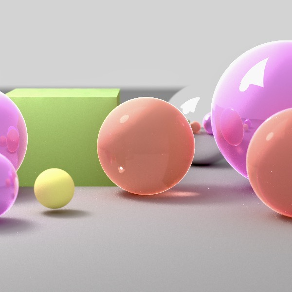

# Monte-Carlo Path Tracer

## Usage:

Use Ant to build the source.

run code:
```
java -cp carbine.jar ray.ParaRayTracer scene/cbox.xml
java -cp carbine.jar ray.ParaRayTracer scene/cbox-direct.xml
java -cp carbine.jar ray.ParaRayTracer scene/cbox-global.xml
java -cp carbine.jar ray.ParaRayTracer scene/cbox-RR.xml
java -cp carbine.jar ray.ParaRayTracer scene/three-spheres.xml
java -cp carbine.jar ray.ParaRayTracer scene/earth.xml
java -cp carbine.jar ray.ParaRayTracer scene/teapot.xml
```

<div align="center">

</div>


<div align="center">

</div>


### DirectIlluminationRenderer:

300x300 resolution using 100x100 samples:
<div align="center">

</div>


### BruteForcePathTracer:

300x300 resolution using 100x100 samples:
<div align="center">

</div>

320x180 resolution using 50x50 samples:
<div align="center">

</div>


### BruteForceRRPathTracer:

300x300 resolution using 100x100 samples:
<div align="center">

</div>

### Texture mapping:
300x300 resolution using 100x100 samples:
<div align="center">

</div>

<!-- ### Creative Scene: -->
300x300 resolution using 100x100 samples:
<div align="center">

</div>

200x200 resolution using 60x60 samples:
<div align="center">

</div>
<!-- Cause the light source is very small, so the image is very noisy. -->
